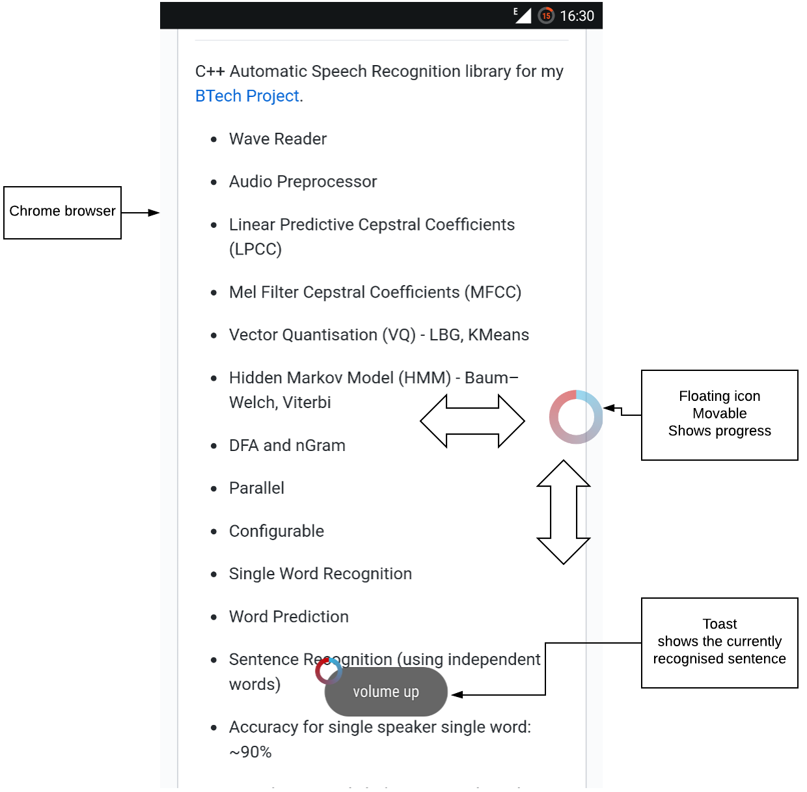

# Android voice controlled assistant

Easily setupable, doesn't require internet, and works minimally but accurately.

### Actions

* Open applications
* Enable/disable Bluetooth
* Control music player
* Enable/disable Wi-Fi
* Make phone calls
* Control brightness
* Enable/disable torch
* Control volume

### Screenshot

### How to build?

The application communicates with sr-lib using NDK.

For humans:
* Get Android Studio (with CMake tools)
* Open project
* Click `Make project` from the Build menu
* Click `Run run` from the Run menu
* Connect mobile phone
* Profit???

For nerds:
* Use the command line to build and run with gradle