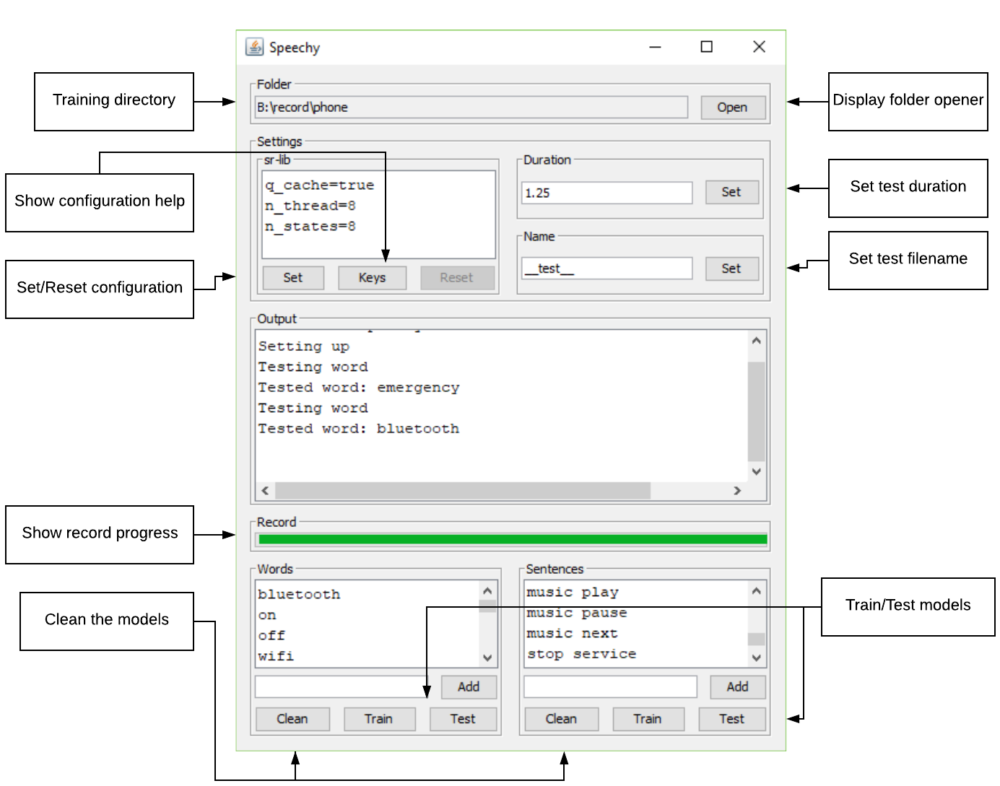

# GUI application for training

Record, train, and test models for sr-lib on windows or linux.

### Demo

https://drive.google.com/open?id=1Nxp6N-tcPvVseigJ5xn4-zFADHkn8kPa

### Screenshot

### How to build?

The application communicates with sr-lib using JNI.

For humans:
* Get Intellij IDEA
* Open desktop
* File menu > `Project Structure` > `Libraries` > `+` > select build folder of sr-lib (preferably release version)
* Click `Build project` from the Build menu 
* Click `Run Speechy` from the Run menu
* Profit???

For nerds:
* Add build folder containing Speechy.dll or Speechy.so to java library path
* Use the command line to run the java program